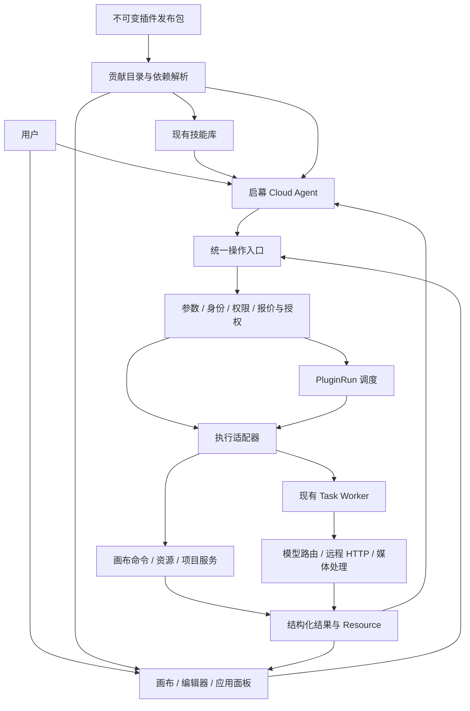

# Qimu 应用插件平台 v3：需求与整体架构设计

> 状态：拟议设计，尚未实现。当前代码支持的 Manifest 为 `yingce.plugin/v1`、`yingce.plugin/v2`；本文的 v3 是本次目标合同，不是已发布版本。
> 代码基线：qimu `4eaa28b8`。本轮只交付文档，没有实施接口、数据库迁移、插件运行时或模型调用。

配套文档：[插件开发接入指南](../content/docs/plugins/application-plugin-v3-integration.md)、[改造实施设计](../plans/qimu-plugin-platform-v3-implementation.md)。目标合同以本文件和接入指南为准，实施顺序以实施设计为准。

上述实施设计已拆解为[分阶段实施手册](../plans/qimu-agent-plugin-platform-execution-runbook.md)，后续按 P00–P14 执行，包含各阶段具体步骤、验收关口和回退方式。

面向 Agent + 画布 + 插件 + 技能的工作台扩展，见[可组合工作台补充设计](qimu-composable-workbenches-design.md)：整合小云雀报告中的会话、动态输入栏和业务资产思路，并明确与本方案的职责及分阶段边界。工作台、配方、自定义对象贡献尚不属于首期已开放合同。

## 1. 产品定位与范围

启幕建设应用插件平台。插件是安装、版本和分发单位；Agent、画布、编辑器、应用面板是消费入口。插件可以提供工具、技能、业务流程、界面、资源连接或模型协议，不要求所有插件使用画布或工作流。

主要目标：第三方作者在宿主已开放的能力范围内，无需修改启幕源码，即可开发、安装、运行和升级应用插件。新插件能被启幕 Agent 发现、理解和调用，并遵守同一权限、预算、任务和资源规则。

### 1.1 本次必须覆盖

- 声明式应用包、固定发布版本、用户启用和依赖检查。
- 包内技能接入现有技能库，支持显式引用和按需发现。
- 可授权的操作合同、后端执行桥接、远程 HTTP 服务适配。
- 简单操作与可恢复多步骤流程，持久化用户输入。
- 结构化结果、来源追踪、通用表单与结果视图。
- Agent 创建及更新受控画布节点，用户操作节点后流程继续。
- 为社区发布者、兼容性、调试与未来隔离运行时保留清晰边界。

### 1.2 本次不实施

- 外部 Codex 接入、对外 MCP Server、开放平台机器身份 API。
- Hypit 集成；自建深度估计或生成模型 GPU 集群。
- 插件商店评分、付费插件分成、公开市场审核运营。
- 任意上传程序在主进程执行、任意 React 代码注入、开放脚本 Hook。
- 一次性替换全部旧插件、全部 Agent 状态机或项目工作流。

上述边界不限制插件通过获准 HTTP 连接调用外部模型或业务系统。外部调用是本期能力；让外部 Agent 控制启幕是后续能力。

## 2. 当前架构与代码证据

以下为本地代码事实，不代表已做运行验收。链接指向当前源码，符号名用于避免行号随重构漂移。

| 编号 | 现有代码 | 核实结果 | 本次处理 |
| --- | --- | --- | --- |
| E01 | [plugin-types.ts](../../web/src/lib/plugins/plugin-types.ts)：`PluginManifestV2`、`PluginContributions` | 有 Provider、workflow、节点、命令、编辑器插槽等声明 | 扩展同一包合同 |
| E02 | [package.go](../../backend/internal/protocol/package.go)：`ParsePluginPackage` | ZIP、路径、文件数及单文件校验；目录尚不包含 skills/operations/pipelines | 新应用包校验复用容器检查并扩充合同 |
| E03 | [protocol_plugins.go](../../backend/internal/app/protocol_plugins.go)：`pluginRuntime`、`install`、`reload` | 现有包存储与协议注册；registry 文件以插件 ID 管理 | 保留旧协议路径，新增不可变发布索引 |
| E04 | [plugin_management.go](../../backend/internal/app/plugin_management.go)：`pluginManagement` | 上传来源默认系统级协议插件；官方应用类别依赖 ID 策略表 | 新应用包走内容校验后由宿主分类 |
| E05 | [plugin.go](../../backend/internal/handler/plugin.go)：`RegisterPluginRoutes` | 当前安装上传入口要求管理员 | 本期保持受控安装，不擅自开放普通用户上传程序 |
| E06 | [plugin-registry.ts](../../web/src/lib/plugins/plugin-registry.ts)、[plugin-host.ts](../../web/src/services/plugin-host.ts) | 前端注册和 HostContext；部分 AI 服务封装 | 保留 UI 注册；服务端掌握执行权限 |
| E07 | [canvas-node-content.tsx](../../web/src/components/canvas/canvas-node-content.tsx)：`PluginCanvasNodeContent` | declarative 基础显示；sandbox 显示等待隔离运行时 | 首期做真实声明式交互，不承诺任意 UI |
| E08 | [plugin-types.ts](../../web/src/lib/plugins/plugin-types.ts)：`PluginAgentAction` | `buildOperations()` 是纯画布操作规划器 | 不加入网络/数据库副作用 |
| E09 | [cloud_agent_tools.go](../../backend/internal/app/cloud_agent_tools.go) | 后端固定工具分派；`skill_read_file` 按需读文件；`cloudAgentWrite` 按名称分类 | 通用操作描述与效果判定接入工具循环 |
| E10 | [cloud_agent_runtime.go](../../backend/internal/app/cloud_agent_runtime.go) | 检查点、审批、媒体子任务、恢复、取消；`ask_user` 结束本轮 | 复用 Agent 运行；增加通用等待引用和持久化流程输入 |
| E11 | [cloud_agent.go](../../backend/internal/model/cloud_agent.go) | `CloudAgentExecution`、`CloudAgentCanvasMutation` | 保留对话和变更记录，不再造 PluginAgent |
| E12 | [models_platform.go](../../backend/internal/model/models_platform.go)、[skills](../../backend/internal/skills) | Skill、SkillVersion、SkillFile、用户安装版本 | 增加插件来源与版本绑定 |
| E13 | [capability](../../backend/internal/canvas/capability) | 服务端画布能力注册表供 Agent/创建/持久化消费 | 继续是画布规则真相源，不复制节点白名单 |
| E14 | [creation.go](../../backend/internal/app/creation.go) | CreationRun 有租约、审批、报价、提交；`prepareCreationTask` 限制受管模型等路径 | 抽取真实公共 admission，不能将任意操作塞进 CreationRun |
| E15 | [project_workflow.go](../../backend/internal/app/project_workflow.go) | 固定短剧阶段与专用完成条件，不是通用 DAG 调度器 | 保留制作里程碑；新增轻量插件流程 |
| E16 | [task_worker.go](../../backend/internal/app/task_worker.go)、[task_execution.go](../../backend/internal/app/task_execution.go) | 租约/并发/超时；类型分派及时间线专用路径；部分异步恢复偏视频 | 注册通用 Task 执行策略，不认为改一个类型即可完成 |
| E17 | [models_task.go](../../backend/internal/model/models_task.go)、[resource_reference.go](../../backend/internal/repository/resource_reference.go) | Task/Result、资源引用与删除保护基础 | 结果引用必须进入已有资源保护链 |
| E18 | [timeline_render_plan.go](../../backend/internal/app/timeline_render_plan.go)：`buildRenderPlan` | 主要按图片/视频片段组织拼接；不完整承接独立配音轨混合 | 出海合成单独补能力及验收 |
| E19 | [payment/rpc.go](../../backend/internal/payment/rpc.go)、[protocol_plugins.go](../../backend/internal/app/protocol_plugins.go) | 支付专用 RPC 可执行包内程序；不能据此认定通用隔离已存在 | 不把支付执行器直接开放给社区应用 |

现有前端 CanvasOperation 比后端 Agent 开放集合更宽；后端 `canvas_apply_ops` 当前限制批量、字段且禁止删除和任意媒体 URL。v3 首期以服务端真实能力为准，不因 TypeScript 联合类型中有某操作就开放执行。

相关既有设计：[插件平台调研](plugin-platform-and-marketplace-research.md)、[编辑器预设 ADR](../adr/0005-editor-preset-plugin-architecture.md)、[Agent Home 设计](xiaoyunque-agent-home-replica-design.md)。它们是背景及并行方案；本文具体化插件底座，不要求先完成首页改造。旧文档中的 `service/` 实现定位以当前 `app/` 为准。

## 3. 用户角色与需求

| 角色 | 需要完成的事情 |
| --- | --- |
| 普通用户 | 启用应用、引用技能、补输入、预览修改、查看费用和结果、恢复或取消 |
| 插件作者 | 查 SDK、编写能力包、独立校验、安装调试、发布新版本 |
| 平台管理员 | 控制可安装应用、服务连接、权限范围、资源用量与禁用 |
| 启幕 Agent | 查真实能力、按需读技能、获得 Schema、调用及解释结果 |

### 3.1 功能需求与验收编号

| ID | 要求 | 完成判据 |
| --- | --- | --- |
| FR01 | 安装包中至少一种有效贡献；不强制画布、技能或流程 | 纯技能、纯工具、画布流程应用都能注册 |
| FR02 | 技能来源固定到插件发布版本 | 升级不改变运行中的指令和 Schema |
| FR03 | Agent 按权限和实际配置发现操作 | 停用、缺凭证、输入不支持均有明确原因 |
| FR04 | Agent 与界面按钮调用同一服务 | 相同参数、身份和授权产生相同执行计划 |
| FR05 | 支持宿主操作、模型任务、远程 HTTP | 新 HTTP 插件不新增 Agent 业务分支 |
| FR06 | 操作和结果强 Schema 校验 | 无效输入不产生任务，无效输出不发布成功结果 |
| FR07 | 长流程持久化并可恢复 | 关页面/重启后不丢步骤、不重复提交已知任务 |
| FR08 | 用户输入是持久化表单或聊天转结构化输入 | 跨 Agent 轮次仍可提交；旧版本提交被拒绝 |
| FR09 | Agent 可实例化并绑定画布节点 | 节点与结果对应，重复投影不重复创建 |
| FR10 | 支持局部调整和派生运行 | 修改一条映射不重做无关分析；旧结果可追溯 |
| FR11 | 后端权限、费用、取消与配额执行 | 客户端伪造权限/价格无效，取消后不调度新步骤 |
| FR12 | 结果跨插件复用 | 通过 Schema、版本及资源引用协作，无私有实现依赖 |
| FR13 | 独立安装升级、依赖和撤权 | 同版本不同内容拒绝；循环依赖拒绝；撤权阻止后续执行 |
| FR14 | 有开发模板、诊断、错误码与验收资料 | 新作者能用指南独立交付至少一个插件 |
| FR15 | 插件支持非画布目标 | 工具查询无需伪造画布 ID；可返回 Agent 结果卡片 |

### 3.2 非功能要求

- 资源、配置、缓存、执行与结果都按用户隔离；项目/画布只在需要时绑定。读取时同样验证归属。
- 不承诺分布式 exactly-once；以持久幂等键、提交记录、查询恢复和状态不明处理避免重复副作用。
- Agent 上下文采用摘要、按需 Schema 和分页结果；不内嵌视频、深度帧或密钥。
- 宿主统一设置输入大小、输出大小、步骤数、并发和预算上限；插件可声明更小值，不能抬高宿主限制。
- 未完成远程调用不长期占数据库事务或应用全局锁；长时间等待释放执行槽。
- 支持 SQLite 与 PostgreSQL；本地调度和 Redis 协调路径均有恢复验收。
- 测量搜索延迟、调度延迟、恢复耗时、结果导入速度；M0 建立基线后再确定 SLA，不凭空承诺整集处理时长。

## 4. 目标架构

### 4.1 模块责任

| 模块 | 责任 | 不承担 |
| --- | --- | --- |
| 包与发布目录 | 校验、版本、内容摘要、来源、依赖、安装状态 | 执行包内代码 |
| 操作目录 | 操作描述、Schema、能力要求、可用性 | 第二套画布节点规则、供应商报价决策 |
| 统一操作入口 | 身份与上下文解析、参数规范化、效果判定、执行计划 | 直接信任 Agent 的权限和价格 |
| 执行适配器 | 调用已有宿主服务或受控远程服务 | 访问前端 Store、任意 DB、任意 shell |
| PluginRun | 步骤依赖、输入请求、子任务关联、恢复 | 取代 Agent 对话或 Task 作业系统 |
| 结果投影 | 结果索引、视图绑定、画布冲突检测 | 判定生成任务是否应重复提交 |
| 前端 SDK | 通用视图、动作触发、节点/结果选择和订阅 | 真实授权与收费 |

后端新增领域建议 `internal/plugins`，依赖 model/repository 或注入的 Host ports；不得 import `app/service`。`app` 是组合根，注入画布、资源、任务、计费接口。handler 继续通过 `service` 别名导入。前端 API 继续使用现有 `http`。

### 4.2 同一插件，多种贡献

v3 以 `contributes.skills/operations/pipelines/connectors/views/canvasBlueprints` 扩展现有贡献。`canvasBlueprints` 是可选画布布局与绑定模板，`canvasNodes` 是节点类型定义，二者不可混用。

目标合同允许组合旧有贡献，但首期 v3 应用仅开放已完成版本隔离的贡献。混合旧 providers 的 v3 包须等协议运行时支持按 releaseId 装载后再开放；此前可通过宿主模型 Adapter 使用既有 Provider，不静默回退到可变 registry。

- Skill 教 Agent 使用能力，不授予执行权限。
- Operation 是可调用合同，可被 Agent、按钮或流程调用。
- Pipeline 是版本化 DAG，可复用跨插件操作，不等于既有 Provider workflow。
- Connector 是出站服务协议声明；用户连接实例保存凭证。
- View 只消费结构化结果并触发命名动作。
- Blueprint 组织业务节点；连线不是运行状态真相源。

所有贡献的稳定地址为 `pluginId.localId`，发布版本独立传递。跨插件引用显式声明依赖，启动时解析为固定 releaseId 和合同摘要。业务插件不自行覆盖 `qimu.*` 的宿主操作命名空间。

### 4.3 SDK 生命周期与开放级别

| 级别 | 可实现的扩展 | 本期 |
| --- | --- | --- |
| 声明式组合 | 技能、操作绑定、流程、视图、画布模板 | 实现 |
| 远程服务 | HTTP 同步/异步 API、特殊算法、外部素材服务 | 实现 |
| 宿主新原语 | 新媒体算法、特殊编辑命令 | 由维护者添加 Adapter 和合同测试 |
| 任意自定义 UI/计算 | 隔离 iframe/worker、远程受管执行容器 | 后续独立设计 |
| 平台事件扩展 | 声明式订阅、过滤、幂等及循环抑制 | 保留边界，先做内部运行事件 |

可插拔不意味着所有新原语都不需要宿主升级。社区第一阶段先开放可校验的声明式应用与远程 API 适配。

## 5. Agent 能力发现与执行

### 5.1 工具面

目标宿主工具：`operation_search`、`operation_describe`、`operation_invoke`、`plugin_run_get`、`plugin_run_resume`、`plugin_run_cancel`、`result_read`。固定工具是通道，具体权限由解析后的 Operation 决定。流程作为 `execution.kind=pipeline` 的 Operation 暴露，不再多一套业务启动工具。

技能发现扩展现有技能库；正文继续 `skill_read_file`。初始上下文只放有界摘要，显式引用优先；自动匹配只检索当前启用且作用域允许的内容，不自动安装缺失插件。

`operation_invoke` 不能统一判为读操作。服务端解析目标、规范化参数，构造实际效果集合，再调用现有权限与审批策略。输入不允许指定 userId、凭证、价格、任意上游 URL 或伪造资源归属。

### 5.2 运行快照

Agent checkpoint 增加当前使用的 releaseId、技能 versionId、操作 contractHash、授权摘要及通用等待引用。新增 `PendingExecutionRef` 区分 Task 与 PluginRun；保留旧 MediaTaskID 的既有运行恢复路径，迁移按实施设计处理。

操作描述固定，但当前撤权和连接停用在每次实际执行前重新检查。正常升级不替换已固定的合同；安全撤权可以阻止旧运行继续。

### 5.3 等待与唤醒

固定流程不依赖 LLM 循环存活。Agent 可以返回运行卡片并结束本轮，流程继续在后端运行。结果与下一步输入会显示在卡片中；需要创作判断时通过用户继续对话或已有 Agent continuation 入口产生下一轮，不直接复活已终态的旧轮次。

`wait_input` 使用持久表单。节点提交和聊天提取的输入都进入同一接口；聊天提交必须指明字段、runRevision/inputRevision，避免把闲聊当成用户选择。仅草稿编辑不触发收费重算，明确提交或在已授权的自动提交策略下才继续。

FR15 的边界：当前 Cloud Agent 强依赖 CanvasID，非画布 PluginRun 和目录 API 可以先独立工作；让 Agent 无画布调用插件需单独把上下文从必填画布改为受控可选，不依赖尚未实施的 Agent Home 方案，也不伪造空画布。

## 6. 权限、审批与费用

执行权限取平台策略、用户安装授权、操作最低权限、Agent 模式、项目/资源范围和本次审批的交集。SDK 的声明是申请；Adapter 的最低权限与实际效果是强制底线。

保持已有 `canvas.read`、`canvas.write`、`media.read`、`asset.*`、`generation.run`、`timeline.*` 等权限。拟新增 `connection.use`、`resource.create`、`plugin.data.read/write`，每项均绑定具体连接、资源或插件命名空间，不使用全局 wildcard。`external.open` 不是任意网络权限。

效果分为读取、草稿写入、受管生成、外部写入、删除/发布。能力效果和数据发送范围不能仅凭作者标注降为只读。平台受控安装及 Adapter 校验先满足本期边界；不声称能自动证明任意外部服务无副作用。

审批绑定 releaseId、operation、规范输入摘要、作用域、输入/画布版本及报价摘要。输入或执行范围改变后旧审批失效。对于已有生成工具，沿用当前强制审批语义，不借通用入口扩大自动权限。

批次预算授权是本次流程阶段需要新增的独立能力：限定操作/模型集合、最大任务数、总额度和有效期；并发任务先在同一事务原子预留，再执行和结算。未实现之前使用现有逐任务授权，不假装已支持一键批次批准。

模型费用继续使用已有账务；远程服务在不同币种/计价单位下保存原始用量与价格来源。没有可信计价时显示未知，只有明确接受未知费用风险或可强制的服务额度上限时可执行，不填 0 或伪造价格。插件商店售卖/分成与运行费用分开，后者本期必要，前者延期。

## 7. 执行、数据和恢复

### 7.1 现有对象的边界

| 对象 | 保持的职责 |
| --- | --- |
| CloudAgentExecution | 对话轮次、模型决策、工具结果、既有工具审批；新插件审批只持引用 |
| CreationRun/Submission | 现有创作及画布提案提交；公共报价逻辑抽取后复用 |
| WorkflowInstance/Step | 短剧项目制作里程碑 |
| Task | 一次实际作业、租约、上游任务、用量与资源导入 |
| PluginRun/Step（新增） | 单操作的持久调用或多步骤业务流程，不新增 SkillRun/ExperienceRun |

纯读取短操作可同步返回，不创建 Run。持久副作用或异步操作统一创建 PluginRun：简单调用只有一步；Pipeline 有多步。实际重作业仍由 Task 执行，不创建第二个任务队列。

### 7.2 最小数据集合

| 数据 | 关键字段与职责 |
| --- | --- |
| PluginRelease（新） | pluginId、version、publisherId、digest、manifest、packageKey、validationStatus；同 ID/version 内容不可变 |
| UserPluginState（扩展） | enabled、installedReleaseId、grantedPermissions、revision；不保存明文凭证 |
| PluginSkillBinding（新） | releaseId、localSkillId、skillVersionId；唯一绑定并进入资源回收引用检查 |
| PluginConnection（新） | owner、plugin/connector、configRevision、credentialRef、status；凭证使用现有加密设施的适配端口 |
| PluginRun（新） | owner、可选 projectId/canvasId/agentRunId、releaseLock、entryOperation、inputRevision、status、revision、lease/fence、scope、budget/approval snapshot、error |
| PluginRunStep（新） | runId、stepKey、itemKey、attempt、inputDigest、operationLock、taskId、status、outputRefs、submissionState、providerTaskId、nextPollAt；调度受 Run/Task 的租约与 fence 保护 |
| PluginRunEvent（新） | runId、sequence、type、boundedPayload；状态事务内写入，提供重放和审计 |
| PluginData（后续按需求） | owner+plugin+scope+key 命名空间，CAS、配额、schemaVersion；本期只承接配置/表单/运行数据，不承诺任意 KV 已有接口 |

表名、字段和索引细节见实施设计。输入请求与授权记录先存 Run 中有界、版本化 JSON，不马上拆出专门审批引擎。多次提交保留事件和引用，敏感正文不上事件流。

### 7.3 状态与恢复规则

Run 状态：`queued/running/waiting_input/waiting_approval/paused/succeeded/failed/cancelling/cancelled`。Step 状态：`pending/ready/running/waiting_task/waiting_input/waiting_approval/succeeded/failed/skipped/cancelled`。上游提交不明以 `submissionState=unknown` 保存并暂停流程，不能伪装为普通失败重试。Task 状态保持原集合。

写入顺序：先保存调用/步骤身份及输入摘要 → 原子创建或关联 Task → Worker 提交上游 → 保存上游 ID → 轮询 → 校验并导入结果 → 保存步骤终态 → 投影画布。

提交崩溃窗口无法靠本地事务消除。上游支持幂等时用稳定键重取；支持查询时先查；两者都不支持时暂停并暴露未知状态。超时不自动判定“未创建”。

Worker 恢复不增加 attempt；用户明确重做产生新 attempt。同一执行的成功结果不可覆盖。取消先持久化取消意图，阻止新步骤，取消子任务；上游取消失败保留记录。已成功导入的结果保留。

### 7.4 局部修改

首期采用派生运行：新 Run 保存 parentRunId 和新的输入版本，复用未受影响的成功结果引用；受影响步骤及其下游重新调度。原 Run 保留，避免让已成功的步骤回到运行态。复用条件包含源资源/输入摘要、操作及模型配置版本，不以节点标题或临时 URL 为缓存键。

只读分析可显式缓存；随机生成默认不缓存且不跨用户复用。删除源资源时已有依赖保护必须涵盖 PluginRun、结果和缓存引用。

## 8. 结果与画布交互

ResultRef 包含 `runId/stepKey/itemKey/attempt/outputKey/schemaId/schemaVersion/digest/resourceId?`；小 JSON 可内联在步骤结果，大结果放 Resource 并分页读取。原始数据与修正输入分开，结果来源可追溯。结果引用不允许隐式跨用户读取。

inline 读取的临时返回值没有 runId，不属于持久 ResultRef。用户选择保存到画布时，由宿主保存动作校验来源与摘要，创建单步 PluginRun 固化结果，再绑定画布，不重新执行收费操作。

画布是业务交互投影，不是执行真相源。Blueprint 保存节点模板、相对布局、输入/输出绑定和动作；实例化时由宿主分配真实 nodeId，并保存 bindingKey 到 nodeId 的映射。重复实例化使用幂等键避免重复节点。

首期提供标准 `plugin-input`、`plugin-result` 节点描述及通用视图（拟新增）；它们必须同时进入前后端画布合同。注册节点样式不等于获得任意 metadata 写权限。已有文本、图片、视频、分镜节点按当前后端能力复用。

View 支持表单、表格、实体卡片、替换映射、媒体对比、进度与错误。所有按钮绑定公开 Operation 或宿主输入提交动作；不能绑定任意 JS、URL 或数据库更新。

结果回写使用受控命令、目标归属和 snapshotHash。冲突时保留 Task/Resource 成功结果，将 projectionStatus 标为 conflict，提供重新绑定或新建节点。投影失败不重跑收费操作。删除展示节点不默认取消后台运行。

用户交互采用业务粒度：镜头组、人物列表、替换方案和结果，下载/轮询/抽帧等内部步骤放进详情。支持 Agent 引导高亮下一输入节点、用户选中结果继续聊天；不为每个技术步骤创建画布节点。

时间线改动需独立 Adapter。现有前端命令不等于后端已能离线执行；M5 必须明确服务端保存与命令落地路径，否则标注该操作仅支持在线编辑器且不进入后台自动流程。

## 9. 插件生命周期与未来生态

- 管理员安装包 → 校验全部贡献及引用 → 登记不可变发布 → 用户启用版本/绑定连接 → 进入能力目录。
- 分类按可信来源策略和贡献类型计算，不允许上传包自选管理员级别；UI 分类不成为权限来源。
- 普通停用阻止新运行；已授权运行默认按固定版本完成，并提供同时取消选项。管理员撤权阻止未执行步骤并尝试取消在途任务。依赖插件同样检查撤权。
- 升级发布新版本；用户激活版本原子切换。运行锁保留依赖版本；不自动升级在途依赖。
- 卸载移除启用入口，保留历史记录/资产及被引用版本；物理 GC 按引用和保留策略执行。
- 本期发布者身份由管理员登记并与插件稳定 ID 绑定；包中的 publisherId 只是声明，不等于可信签名。社区后续增加发布者认证、签名、扫描、撤回、审核和兼容矩阵。
- 任意 UI/代码运行时新增时必须声明运行环境、依赖和资源配额；不会将已有支付 RPC 的系统权限继承给普通应用。

## 10. 参考项目吸收范围

`open-ai-canvas` 基线 `543b7fde`：借鉴 `canvas_capability_contract.go` 的版本化能力与引用检查、`tool_adapter.go` 的宿主执行边界、`workflow_artifact.go` 的不可变结果和 bindingKey、`workbench_registry.go` 的视图合同。路径均在参考仓库 `backend/internal/service/`，实施时落到 qimu 正确分层。

不移植整套 SkillRun/Experience/Workspace；不把内置业务 JSON 常量作为通用包管理方案；不把 `workflowExportAdapter` 返回的 JSON 汇总当成真实成片导出。`export.package` 在参考实现仍有 unavailable 声明。

`OpenMontage` 基线 `08e2151`：借鉴 `tools/base_tool.py`、`tool_registry.py` 的输入输出、可用状态、资源需求、相关技能。其 Agent 按阶段技能编排适合学习用法，但启幕的费用、幂等和恢复由后端强制。其 localization-dub 标注 beta，不能视为全人物/场景替换方案。

Codex 的借鉴限于“插件包组合技能与工具连接、技能按需加载”的产品思想，官方资料：[Skills & Plugins](https://learn.chatgpt.com/docs/skills-and-plugins)、[Build skills](https://learn.chatgpt.com/docs/build-skills)。本次不引入 Codex SDK、外部 Codex 插件或对外 MCP。

## 11. 业务验证与完成边界

| 样例 | 验证的通用能力 | 不可替代的业务验收 |
| --- | --- | --- |
| 素材查询与导入 | 非画布操作、HTTP、分页结果、资源写入 | 真实服务查询和归属校验 |
| 品牌规范助手 | 技能、文本分析、结构化报告 | 指南选择与报告有效性 |
| 一键出海 | Agent 建画布、持久表单、并行生成、局部重跑、合成 | 人物一致性、对白/背景音、时长对齐、导出 |
| 深度视频提取 | 远程长任务、控制资产格式、时序元数据 | 真实深度 API 和下游生成输入兼容 |

一键出海完整目标保留人物、场景、道具、声音替换；字幕配音阶段完成不等于整个应用完成。原始音轨分离、说话人关联、烧录字幕处理、镜头编辑模型输入和多轨渲染都需专项开发或远程服务。

深度估计输出必须区分预览灰度视频与真实控制数据。深度不能独立保证动作/身份/运镜复现；需要时另外提供姿态、分割/跟踪、相机运动。结果需记录 sourceResourceId、时间基准、帧映射、尺寸、编码、近远方向、归一化和无效值；模型不支持该控制输入时拒绝组合，不能退化成普通提示词生成并宣称复刻成功。

平台完成标准：至少纯技能、非画布工具、画布长流程三种形态独立安装；新增应用不改 Agent 主循环；权限、版本、恢复、取消、资源引用和费用检查通过。业务样例是否达到出海/复刻质量单独记录。
