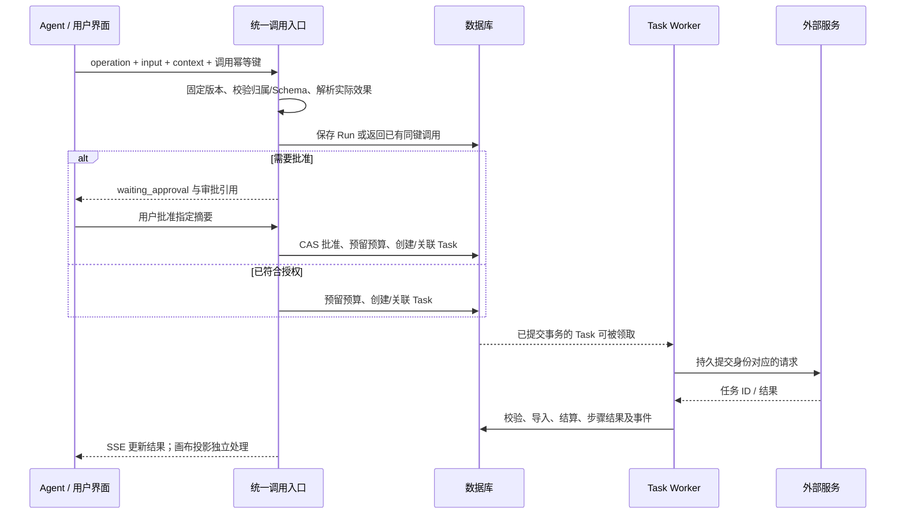

# Qimu 应用插件 v3：能力提升改造实施设计

当前调整：提前交付 [P14A 插件收尾](qimu-plugin-closeout-acceptance.md)，工作台与出海后置。作者工具与实际接入合同见最新指南；本文件后文保留整体设计，不代表所有目标已开放。

> 状态：起始基线 qimu `4eaa28b8`。P00–P07 已验收。P08 增加持久 Thread、首页原地对话和跨画布继续，追加 schema 36，复用原 Agent/PluginRun/CreationRun 及账务。当前边界与验收见 [P08 接入与验收](qimu-plugin-p08-acceptance.md)。只合入插件集成分支，不合入 main；未部署或迁移业务环境。
> 配套：[需求与整体架构](../design/qimu-plugin-platform-v3-design.md)、[插件开发接入指南](../content/docs/plugins/application-plugin-v3-integration.md)。本文回答改哪里、如何迁移、如何验证、什么条件才算完成。

实际分批执行统一使用[分阶段实施手册](qimu-agent-plugin-platform-execution-runbook.md)的 P00–P14 编号。本文 M0–M7 保留为设计模块映射；最小画布闭环已前移到 P03，多工作台与出海的分支依赖以手册为准，不重复执行多套计划。

多工作台扩展及与旧 Agent Home 计划的合并顺序，见[可组合工作台补充设计](../design/qimu-composable-workbenches-design.md)第 6 节。统一会话/可选画布上下文并入本计划 M2；工作台配置与业务对象按 W0–W4 推进，不另外复制插件执行、审批或 Task 调度。

## 1. 结论与实施边界

现有 qimu 已有插件包、用户启用、技能版本、Cloud Agent、画布能力合同、Task Worker、资源与计费，可在此基础上扩展。缺口主要是：可执行应用操作合同、跨入口一致的授权、外部服务连接、可恢复的业务流程，以及通用输入/结果交互。

建议采用“保留现有主干，增加应用插件领域”的方案。初期接入只读操作改动较小；完成可靠的异步应用平台属于中高复杂度改造，涉及任务恢复、审批、账务与画布合同，不能按新增几个前端插件文件估算。业务应用尽量独立成包，平台不写 `if pluginId == video-localization` 等业务分支。

本期不接 Hypit、不做外部 Codex/MCP、不开放任意本地代码执行、不建设公开收费市场。对外 HTTP 连接属于本期；供外部系统控制启幕的机器身份 API 属于后续。

三个交付边界独立验收：

| 交付 | 必须证明 | 不能用来替代它的结果 |
| --- | --- | --- |
| 通用插件平台 | 纯技能、无画布工具、带画布的持久流程都可独立安装与运行 | 仅内置一个出海页面 |
| 一键出海应用 | 指定输入下完成分析、方案确认、替换、真实媒体合成 | 只生成提示词、JSON 或配音字幕 |
| 深度提取插件（后续） | 真实远程服务输出时序正确的控制资产 | 仅显示反色/灰度预览，或普通视频生成 |

## 2. 文件级改造清单

以下“新增”路径是实现建议，尚不存在；现有文件均来自本地代码。允许实现时按职责微调文件名，但不得将业务逻辑放进 `service` 别名层。

### 2.1 后端

| 位置 | 状态 | 改造内容与边界 |
| --- | --- | --- |
| [protocol/package.go](../../backend/internal/protocol/package.go) | 现有 | 复用 ZIP 容器校验；增加新目录、累计解压限制、包内引用检查；旧支付包按原策略校验 |
| [protocol/manifest.go](../../backend/internal/protocol/manifest.go)、[types.go](../../backend/internal/protocol/types.go) | 现有 | 识别 v3，保留 v1/v2 含义；通用应用合同放 plugins 域，避免协议包发展成业务调度器 |
| `backend/internal/plugins/contracts.go`、`package_validation.go` | 新增 | Operation/Pipeline/Connector/View/Blueprint 合同；Schema 子集、依赖环、效果及权限校验 |
| `backend/internal/plugins/catalog.go`、`releases.go` | 新增 | 发布版本、操作目录、可用状态、依赖锁、发布者归属与兼容性 |
| `backend/internal/plugins/invocation.go`、`admission.go` | 新增 | 规范输入、身份与范围、实际效果、幂等、审批请求和执行计划；不依赖 app |
| `backend/internal/plugins/ports.go`、`executors.go` | 新增 | 显式 Host/Task/Resource/Quote/Credential 接口；类型化执行，不接受任意函数名 |
| `backend/internal/plugins/runner.go`、`recovery.go` | 新增 | 步骤依赖、持久输入、运行租约、取消、派生与恢复；调度已有 Task，不另建重活队列 |
| `backend/internal/plugins/http_connector.go` | 新增 | 受控请求映射、状态解析、提交恢复策略；HTTP 客户端由宿主注入并执行 outbound 检查 |
| [app/protocol_plugins.go](../../backend/internal/app/protocol_plugins.go)、[protocol_registry.go](../../backend/internal/app/protocol_registry.go)、[plugin_management.go](../../backend/internal/app/plugin_management.go) | 现有 | 安装按版本分流，旧协议 registry 保持；统一目录合并新 Release，禁止 ID 冒用 |
| `backend/internal/app/plugin_application.go`、`plugin_host_adapters.go` | 新增 | 组合根、注册受控宿主适配器、注入已有领域服务；不承载整个流程引擎 |
| [handler/plugin.go](../../backend/internal/handler/plugin.go)、`handler/plugin_runs.go` | 现有/新增 | 保持管理员安装；增加登录态操作、连接、运行、输入、审批与 SSE 路由 |
| [app/cloud_agent_tools.go](../../backend/internal/app/cloud_agent_tools.go)、[cloud_agent_policy.go](../../backend/internal/app/cloud_agent_policy.go) | 现有 | 注册通用工具；`operation_invoke` 根据解析后的效果判定写权限，不只看工具名 |
| [app/cloud_agent_runtime.go](../../backend/internal/app/cloud_agent_runtime.go)、[cloud_agent_media_approval.go](../../backend/internal/app/cloud_agent_media_approval.go)、[model/cloud_agent.go](../../backend/internal/model/cloud_agent.go) | 现有 | 固定合同版本、通用等待引用、审批卡片指针；保留旧媒体任务恢复路径 |
| [app/creation.go](../../backend/internal/app/creation.go)、[task_billing.go](../../backend/internal/app/task_billing.go) | 现有 | 提炼可复用的报价/批准/预留策略接口，保持现有生成行为；不把任意应用调用伪装成 CreationRun |
| [app/task_creation.go](../../backend/internal/app/task_creation.go)、[task_execution.go](../../backend/internal/app/task_execution.go)、[task_worker.go](../../backend/internal/app/task_worker.go) | 现有 | 联动修改 admission、类型白名单、执行分派与 Worker；只有真实执行器就绪才开放新 Task 类型 |
| [app/provider_task_recovery.go](../../backend/internal/app/provider_task_recovery.go)、[provider_task_cancellation.go](../../backend/internal/app/provider_task_cancellation.go)、[task_output.go](../../backend/internal/app/task_output.go) | 现有 | 抽取公共恢复/取消/导入策略；视频专属逻辑保留，HTTP 应用任务使用自己的策略 |
| [skills/skill_packages.go](../../backend/internal/skills/skill_packages.go)、[repository/skill_packages.go](../../backend/internal/repository/skill_packages.go)、[app/skills_bridge.go](../../backend/internal/app/skills_bridge.go) | 现有 | 包内技能导入现有 SkillVersion/SkillFile；目录根据用户版本和权限过滤 |
| [model/models_plugin.go](../../backend/internal/model/models_plugin.go)、`model/plugin_execution.go`、`repository/plugin_execution.go` | 现有/新增 | 发布、连接、运行与步骤持久化；UserPluginState 增加版本/授权/修订号 |
| [repository/resource_reference.go](../../backend/internal/repository/resource_reference.go) | 现有 | 运行、派生结果、蓝图投影与缓存进入资源引用保护 |
| [database/schema.go](../../backend/internal/database/schema.go)、[migrations.go](../../backend/internal/database/migrations.go) | 现有 | 增量迁移与索引；SQLite/PostgreSQL 同等语义；迁移号实施时分配 |
| [canvas/capability](../../backend/internal/canvas/capability)、[app/cloud_agent_mutation.go](../../backend/internal/app/cloud_agent_mutation.go) | 现有 | 标准输入/结果节点、受限绑定字段、能力版本与投影命令；不放开任意 metadata |
| [app/timeline_render_plan.go](../../backend/internal/app/timeline_render_plan.go)、[task_timeline.go](../../backend/internal/app/task_timeline.go) | 现有 | 出海阶段补多轨音频、时基、字幕与实际导出；与平台执行器独立验收 |

目录依赖：`handler → service 别名 → app → plugins → ports/repository/model`。`plugins` 不得 import app/service；Host 实现在 app 注入。避免 plugins 调 app、app 又调 plugins 的编译依赖环。

### 2.2 前端

| 位置 | 状态 | 改造内容 |
| --- | --- | --- |
| [plugin-types.ts](../../web/src/lib/plugins/plugin-types.ts)、[plugin-registry.ts](../../web/src/lib/plugins/plugin-registry.ts) | 现有 | v3 元数据、服务端目录投影、视图与蓝图描述；前端注册不授予权限 |
| [plugin-host.ts](../../web/src/services/plugin-host.ts) | 现有 | 增加受控 operation/run/result 调用；原 buildOperations 保持纯规划 |
| [api/plugins.ts](../../web/src/services/api/plugins.ts)、[api/plugin-catalog.ts](../../web/src/services/api/plugin-catalog.ts)、`api/plugin-runs.ts` | 现有/新增 | 一律使用 http；SSE 单独实现鉴权、AbortSignal、游标和快照刷新 |
| [use-plugin-store.ts](../../web/src/stores/use-plugin-store.ts) | 现有 | 用户作用域隔离；版本、授权和可用性由服务端决定，不能靠 localStorage 激活 |
| `web/src/components/plugins/` | 新增目录 | 通用输入表单、结构化结果、运行卡片、授权卡片、版本冲突与恢复入口 |
| [canvas-node-content.tsx](../../web/src/components/canvas/canvas-node-content.tsx) | 现有 | plugin-input/plugin-result 分派到宿主组件；保留画布事件和可访问性约束 |
| [canvas-operation-contract.ts](../../web/src/lib/canvas/canvas-operation-contract.ts) | 现有 | 对齐服务端开放集合，加入模板实例化与结果绑定的受控合同 |
| [plugins/index.tsx](../../web/src/pages/plugins/index.tsx)、[admin/plugins/plugins-page.tsx](../../web/src/pages/admin/plugins/plugins-page.tsx) | 现有 | 版本选择、权限差异、连接配置、诊断和安装失败原因 |
| Agent 对话/审批消费组件 | 实施时沿 API 调用点定位 | 显示 PluginRun 引用，输入提交与画布共用 API；不复制一份审批状态 |

新交互组件服从已有设计 token。输入草稿可在前端暂存，但“已提交/运行成功”只由服务端确认；账号切换须清理所属订阅和缓存。

## 3. 合同与兼容策略

### 3.1 安装流程

1. 按现有管理员身份验证上传；解析 apiVersion，选择旧包或 v3 应用校验器。
2. 在隔离临时区检查文件数量、总解压字节、路径、格式、Schema、引用、依赖环、权限和宿主版本。沿用当前容器限制作为上限起点，不因新增目录无限放大。
3. 规范化所有贡献并计算包 digest/操作 contractHash；依赖固定到已验证 releaseId。
4. 将校验通过的文件移入不可变 packageKey；数据库事务登记 Release、技能绑定和目录。文件就绪前不可标记可用。
5. 失败包不进入目录；文件写成功但事务失败形成可识别的孤立包，由有界清理流程回收。
6. 用户激活时验证依赖、权限和连接要求。允许部分授权，但相应操作必须显示不可用原因。

首期包中允许的执行方式只有宿主 Adapter、受控 HTTP 和 Pipeline；模型任务走宿主 Adapter。拒绝未知执行类型和引用，即使技能正文要求执行也不能放行。

HTTP 连接的目标主机和协议配置修订属于执行快照；更新连接不能静默将旧 Run 的素材发给新主机。密钥轮换使用宿主凭证设施，在相同连接/服务身份下受控替换，凭证撤销则暂停后续调用。无法保留旧配置的修改应显式使旧运行等待重新配置与授权，不能悄悄用最新配置继续。

### 3.2 避免 registry 双写真相源

现有 `plugin_registry.json` 继续负责原 v1/v2 协议/支付运行时；v3 应用发布由数据库 PluginRelease 管理。目录服务合并两者视图，但不把一个 v3 安装同时写进两套可变注册表。

同一稳定 pluginId 必须只有一个登记所有者和当前安装管理路径。新 v3 不能遮蔽已有官方/上传协议 ID；旧包升级到 v3 需显式管理路径迁移，保留旧发布引用。若后续迁移旧注册表，使用一次性迁移标记、完整验证与明确切换点，禁止长期双写兜底。

首个 v3 应用包仅组合新增贡献。混合声明旧 providers 的 v3 包在“协议运行时按 releaseId 装载”适配完成前应明确拒绝安装；不能声称首期目录扩充就能版本隔离旧 Provider。旧 v1/v2 Provider 可通过既有模型路由被宿主 Adapter 使用，其解析配置进入执行快照。

### 3.3 版本与技能

- 同 pluginId/version 相同 digest 返回已有 Release，不重复导入技能；不同 digest 拒绝。
- PluginSkillBinding 绑定 SkillVersion，文件 hash 校验继续使用现有机制。技能 ID 由宿主映射，不能与用户独立技能冲突。
- Run 固定自己的发布、依赖和技能版本；最新目录只影响新 Run。
- 用户可复制修改技能为独立版本，但这不改变插件合同、已授权限或历史 Run。
- 不自动将所有旧技能/插件补成 v3；明确保留的旧入口继续运行即可。

## 4. 持久化模型与索引

下表为逻辑结构。迁移遵守当前命名习惯，具体列类型由 SQLite/PostgreSQL 的共同能力决定。JSON 字段必须有大小限制和版本号，不承担无限日志或媒体存储。

| 模型 | 必要字段 | 唯一性/索引与约束 |
| --- | --- | --- |
| PluginRelease | id、pluginId、version、publisherId、digest、manifestJSON、packageKey、validationStatus、revokedAt | unique(pluginId, version)；发布内容只增不改；管理状态可改变 |
| UserPluginState 扩展 | installedReleaseId、grantedPermissionsJSON、revision | 保持 unique(userId, pluginId)；激活/授权更新 CAS；旧行新增列可空，不伪造 releaseId |
| PluginSkillBinding | releaseId、localSkillId、skillVersionId | unique(releaseId, localSkillId)；引用版本不能被删除 |
| PluginConnection | id、userId、pluginId、connectorId、configJSON、configRevision、credentialRef、status | 索引(userId, pluginId, connectorId)；一连接实例可多次修订；配置/凭证写入单独权限 |
| PluginRun | id、userId、可空 projectId/canvasId/agentRunId、parentRunId、entryOperation、releaseLockJSON、inputJSON、inputDigest、idempotencyKey、requestDigest、status、revision、cancelRequestedAt、leaseOwner/leaseUntil/fence、nextWakeAt | unique(userId, idempotencyKey)；索引(status, nextWakeAt)、(userId, createdAt)；历史不能覆盖 |
| PluginRun 中有界子对象 | inputRequests、approvalRequests、projectionBindings、budgetRef、eventSequence | 输入/审批各有稳定 ID、revision、摘要与状态；CAS 修改；超出上限转 Resource 或拒绝 |
| PluginRunStep | id、runId、stepKey、itemKey、attempt、status、inputDigest、operationLock、taskId、submissionState、providerTaskId、outputRefsJSON、error、nextPollAt | unique(runId, stepKey, itemKey, attempt)；无批量 itemKey 用固定空字符串；taskId 非空时唯一 |
| PluginRunEvent | runId、sequence、type、boundedPayload、createdAt | unique(runId, sequence)；状态变更同事务写事件；按 run 分页/保留策略 |

Step 的 providerTaskId/submissionState 是与 Task 执行记录对应的状态投影，不成为第二套可独立调度上游的账本；实际提交、轮询与导入由 Task 所属执行器负责。恢复以 Task 执行记录为准，事务或幂等同步 Step。

ResultRef 合同固定为 `runId/stepKey/itemKey/attempt/outputKey/schemaId/schemaVersion/digest/resourceId?`。结果 API 的 resultId 是宿主生成的不可猜测索引标识，映射到该引用，不能当成本地文件路径。小结果保存在 Step；大结果存已有 Resource，引用必须先校验归属。

纯 inline 读取无 Run，其临时返回值不是持久 ResultRef。用户选择保存到画布时，宿主保存动作重新校验摘要与来源，以单步 PluginRun 固化结果，再建立绑定；不得编造 runId，也不重新执行收费操作。

审批和输入先用 Run 有界子对象，事件保留历史。未来若并发/大小指标证明需要分表，再迁移；不在第一期引入完整独立表单引擎或审批引擎。

PluginData 通用 KV 延后；本期配置、输入、状态和结果已分别有存储归属。未来按 user+plugin+scope+key 开放 CAS/配额接口，不直接提供 SQL 或无限文件目录。

### 4.1 引用与回收

Release、SkillVersion、源媒体、输入附件、输出、派生复用结果都进入引用关系。停用、卸载与历史运行删除是不同动作：卸载不物理删除被引用版本和媒体。资源删除检查返回来自哪个 Run/结果的引用；物理删除失败保留记录。

数据库外键与应用层引用检查共同保证约束；不得依赖某个 SQLite 连接默认启用了外键。资源和包存储与 DB 无跨系统事务，必须有 pending/imported/orphan 清理路径和恢复扫描。

## 5. 统一调用、授权与计费

### 5.1 调用流程



上图的外部请求不在数据库事务内。用户界面只是发起与展示入口，不保存最终批准事实。

### 5.2 权限判定

服务端先解析 Operation，再求实际效果集合。Adapter 最低权限、包申请上界、用户授权、Agent 模式、项目/资源归属、连接状态和管理员策略全部满足才执行。operation_invoke 不得仅因固定工具名未列在 cloudAgentWrite 中被判只读。

清晰区分三件事：允许使用插件、允许把某资源发送给某连接、允许产生本次收费/外部写入。Skill 正文和前端 permission check 都不能替代后端校验。等待恢复时重新检查撤权，但不把普通用户停用错误解释为撤销既有授权。

只读本地工具可以短路返回；“发给远程分析服务”包含数据发送和潜在费用，不能因为返回报告就被归类为无副作用本地读取。

### 5.3 审批唯一权威

新 PluginRun 的审批事实只保存在 PluginRun 审批记录；Cloud Agent checkpoint、画布和运行卡片只保存 approvalId/runId 等引用，不复制可变 approved 字段。旧媒体任务继续使用原有审批状态；公共策略/报价内核可复用，具体业务记录不能互相伪装。

批准记录绑定 userId、releaseLock、操作、规范输入、作用域、数据发送范围、报价/模型配置摘要和有效期。新增文件、换国家、扩大镜头范围或切换价格导致摘要变化时，超出原授权部分必须重新批准。

输入请求可由 Agent 提议结构化填写；收费审批必须来自受验证的用户动作，Agent 工具无自批接口。resume 只恢复符合条件的运行，不能跨过 waiting_input/waiting_approval。

### 5.4 预算与结算

复用现有账户账务和 Task 计费记录，不另建插件钱包。批次授权增加预算实体/账务关联时必须有原子预留：多个 ready 步骤竞争同一预算，只有成功预留的步骤可创建 Task。既有事务接口不支持这一点时，先提供逐任务批准，不能靠内存计数模拟预算。

跨币种额度不能直接相加；记录原币、计量单位、来源及锁定报价，换算必须有明确政策。外部服务自带 Key 的账单不等于启幕余额扣费，UI 分开显示“平台扣费”和“第三方可能收费”。没有已知价格不填 0。

任务结果导入失败、画布冲突、SSE 重连都不再次扣执行费用。预算预留、使用和释放分别幂等，以 task/attempt 身份关联。上游未知提交或取消失败时不得盲目释放全部预留并再次消费。

## 6. Task、状态机与故障恢复

### 6.1 执行接口

为插件任务增加固定受控类型（建议 `plugin_operation`），TaskInput 保存 releaseId、operation、输入引用、连接实例与配置修订、run/step/attempt 身份。只有系统构建该输入；用户不能直接传入上游地址、有效权限或密钥引用来绕过 admission。

扩展必须覆盖 `validateTaskType`、创建 admission、Worker 类型分派、恢复扫描、取消策略、结果导入和计费。现有 timeline 在 Worker 有专门入口，`processTask` 也有自己的白名单，不能只添加一个 switch 分支。首次只抽取所需执行接口，避免顺便重写所有 Provider。

执行策略至少表达 Submit、Reconcile、Poll、Cancel、Import，以及是否支持上游幂等/查询/取消。当前视频恢复逻辑不能直接假设所有 Connector 都遵循视频 Provider 的字段。

### 6.2 状态转换约束

Run 状态集合：`queued/running/waiting_input/waiting_approval/paused/succeeded/failed/cancelling/cancelled`。Step 状态集合：`pending/ready/running/waiting_task/waiting_input/waiting_approval/succeeded/failed/skipped/cancelled`。Task 保持原有状态集合；阶段细节放执行记录。

| 事件 | 转换/处理 |
| --- | --- |
| 入参通过且无需等待 | queued → running；依赖满足步骤 pending → ready |
| 等待用户选择 | Step waiting_input；无其他可推进步骤时 Run waiting_input |
| 待收费/外部写入批准 | Step waiting_approval；无可推进步骤时 Run waiting_approval |
| 多种等待同时存在 | 响应列出全部请求；Run 优先显示 waiting_approval，其次 waiting_input，不隐藏另一类请求 |
| 子作业创建成功 | Step waiting_task；Run running，不占用一个 LLM 循环等待 |
| 提交结果不明 | submissionState=unknown；Run paused，reason=upstream_submission_unknown |
| 确定失败 | Step failed；首期 fail-fast，不调度新步骤；已在途任务尝试取消并保留最终记录 |
| 所有必要步骤结束且输出有效 | Run succeeded；skipped 必须符合合同允许的输出映射 |
| 用户取消 | Run cancelling，阻止新作业，发起已有 Task 取消 |
| 取消处置结束 | Run cancelled；明确报告不可取消的外部残留，不声称上游必然停算 |

有失败且远程任务仍在途时 Run 可保持 cancelling，终止原因标记 failure；处置结束以 failed 收束。终态不被迟到消息改回 running；迟到结果只补充 Task/资源审计及残留情况。

### 6.3 幂等、租约与提交不明

三个键分工：调用键识别用户意图；step/item/attempt 识别一次作业；provider 幂等键识别同一次上游提交。Worker 接管同一次作业不能增加 attempt 或换 provider key。

1. 短事务写 Run、Step 身份及待执行意图。
2. 领取时取得 lease 和递增 fence；所有状态写入检查 fence，旧 Worker 不可覆盖新 Worker。
3. 原子预留预算、创建/关联唯一 Task，并保存 prepared 提交记录；事务提交后才能发网络请求。
4. 外部调用前确认本地执行权，但承认“确认后进程暂停”仍有竞态；上游幂等才能覆盖网络侧重复窗口。
5. 返回上游 ID 后立即持久化；轮询按 nextPollAt 调度并释放执行槽。
6. 上游成功后进入导入阶段，校验输出、资源导入及摘要，保存结果/结算，然后更新 Step 和事件。

上游不支持幂等和查询时，超时、连接断开或恢复遇到“已准备、可能已发出”不能自动重发；保存 unknown 暂停。提供管理员/用户核实入口，补真实上游任务 ID 或明确确认新建 attempt。该决定及潜在重复收费提示进入审计。

fence 只能保护本地写入，不能撤回已发外部请求；文档与界面不得宣称 exactly-once。

### 6.4 结果导入与画布投影分离

执行阶段另记 `upstream_completed/import_pending/imported` 等内部值，不加入 Run 公共状态集合。导入重试使用上游任务 ID 和输出摘要，不再调用生成接口；临时 URL 过期优先重新查询/续签，无法恢复则报告结果不可取。

结果校验失败返回 upstream_output_invalid，保留诊断，不发布 succeeded。下载和响应大小有界，禁止“下载成功就是可信媒体”；必要时校验 MIME、解码和时长。

投影另记 `pending/applied/conflict/failed`。画布保存失败保留成功的 Run/Task/Resource；用户可重新绑定或新建结果节点。删除展示节点不等于取消 Run。

### 6.5 派生与缓存

局部重做使用新 Run，parentRunId 指向原运行。比较规范输入、源资源 digest、操作 release/contractHash 和模型配置，计算受影响步骤的依赖闭包；复用其余成功 ResultRef。首期仅当前用户可复用，不跨租户缓存。

foreach 按稳定 itemKey 关联镜头，不能按完成时间关联。字段映射只有字符串 JSON Pointer；不支持宿主无法静态确定依赖的脚本。随机生成默认不缓存，用户明确重做会创建新的 attempt；相同 HTTP 重试键不代表用户要求新内容。

## 7. Agent、画布与界面交互

### 7.1 Agent 工具与上下文

增加 `operation_search/operation_describe/operation_invoke/plugin_run_get/plugin_run_resume/plugin_run_cancel/result_read`，技能读取继续使用现有 skill_read_file。目录返回可用原因及版本；描述按需加载 Schema，结果默认摘要与分页引用，避免整集分析占满上下文。

Cloud Agent 当前必填 CanvasID，因此分两步推进：先让运行 API 支持可选画布；再扩展 Agent 的显式上下文类型，检查创建、恢复、policy、提示词、画布工具和事件所有消费点。无画布时不注入画布编辑工具，调用要求画布的操作返回 operation_unavailable。不能用空 ID/自动创建假画布规避验证。

PendingExecutionRef 用类型区分 Task 与 PluginRun；旧 checkpoint 的 MediaTaskID 继续按旧路径恢复。只在实际存在新引用时启用新处理器，避免旧在途任务被错误重置。

Agent 可以返回运行卡片后结束本轮。后台流程不依赖 SSE 或 LLM 连接；wait_input 持久保存待填内容，用户提交后继续 Run。需要新的创作判断时进入新一轮 Agent，不把已完成轮次复活，也不把 ask_user 当成现成暂停点。

### 7.2 画布合同

在后端 capability 注册 plugin-input/plugin-result 及字段 Schema；前端消费同一版本/hash，建立一致性测试。Blueprint 只能引用已注册节点和命名视图，不能随包注册任意后端可写字段。

实例化输入包括真实 canvasId、snapshotHash、blueprint/releaseId、允许的绑定引用和幂等键。服务端按 bindingKey 分配 nodeId、生成受控操作并保存映射。现有 canvas_apply_ops 单批上限为 20；大蓝图应限制规模或由宿主分批保存可恢复投影计划，不允许插件绕过上限直接提交原始画布 JSON。

撤销仅撤回画布表现层变更，不撤销已产生费用，也不默默删除资源。跨批次部分完成时展示明确状态，可继续投影或撤回已创建节点；不得宣称整批原子成功。

用户同时编辑画布时使用 snapshotHash/CAS；冲突后重新读取，只应用仍符合预期的绑定。历史结果的自动回写不能覆盖用户新修改的名称、提示词或素材。

### 7.3 表单、结果与事件

MVP 先实现 form/table/key-value/progress，再为出海补 mapping-editor/entity-cards/media-compare。视图只表达宿主已有组件，按钮只调用公开操作或提交指定 inputRequestId。

输入提交带 runRevision/inputRevision/Idempotency-Key；重复同内容返回首次结果，同键不同内容拒绝。跨标签页旧表单不覆盖新方案。聊天提取只能填已知字段，无法确定的内容保留待用户选择。

SSE 事件随状态同事务写，单 Run sequence 连续递增；发布失败可从 DB 重放。用户权限/账号变更后断开不再授权的订阅。事件保留过期要求客户端刷新快照，不伪造完整历史。

## 8. 一键出海应用实施

应用建议稳定 ID `video-localization`，能力仍通过通用 Operation/Pipeline 暴露。技能负责解释用法、引导国家/风格选择和结果评估；步骤身份、素材映射、批准和执行在后端。

### 8.1 输入与结构化产物

| 对象 | 最少信息 | 用户交互 |
| --- | --- | --- |
| 源视频 | resourceId、digest、时基、时长、音视频流、授权发送范围 | 上传/选区引用，选择全片或片段 |
| 镜头表 | shotId、开始/结束时间、人物/场景/道具引用、动作/运镜描述、置信度 | 预览对应片段，修正边界 |
| 实体表 | characterId/sceneId/propId、出现镜头、参考帧/素材、识别不确定项 | 合并/拆分、指定替换素材 |
| 音频与对白 | segmentId、起止时间、speakerId、文本/语言、源音轨引用、背景音情况 | 确认说话人与角色，修正台词 |
| 本地化方案 | 目标国家/语言、语境/风格、实体替换映射、提示词、配音、字幕样式 | 用户选择后提交，草稿不收费 |
| 镜头执行计划 | 模型能力、控制输入、时长、输出规格、报价、可编辑范围 | 批准计划或缩小范围 |
| 成片计划与结果 | 镜头排序、独立音轨、字幕、转场、规格、版本、Resource 引用 | 预览、局部派生重做、导出 |

实体识别不保证自动获得可直接编辑的干净分层素材；需要分割/跟踪/音源分离时用单独 Operation。低置信度项必须让用户纠正，不能靠一句 Skill 指令消除模型误差。

### 8.2 流程

`媒体探测 → 镜头/实体/对白分析 → 目标国家与替换方案确认 → 能力与费用检查 → 并行镜头编辑和配音 → 对齐与质量检查 → 合成 → 成片与局部重做`。

远程服务负责适合其能力的分析/分离/生成；启幕负责 Task、资源、用户映射、时序、授权和结果组织。调用模型不意味着服务器零资源：仍需上传下载、存储、抽帧/探测、转码/混音与导出。优先按需抽帧、限制分辨率/并发、复用源资源，重媒体作业进入现有 Worker 配额。

### 8.3 分阶段业务验收

| 阶段 | 可交付范围 | 验收重点 |
| --- | --- | --- |
| L1 分析与方案 | 原视频拉片、实体与对白结构化、国家适配建议、用户修正 | 镜头/实体 ID 稳定、可追溯原片、长任务恢复 |
| L2 配音字幕 | 翻译、语音选择、时间对齐、字幕及真实多轨成片 | 原对白处理、背景音保留/替换、音画同步；烧录字幕有明确处理方式 |
| L3 视觉替换 | 人物、场景、道具逐镜编辑，素材与提示词推荐 | 真实视频编辑/控制模型支持，身份一致、遮挡、手部和镜头连续性 |
| L4 联合成片 | 视觉+语音替换组合、批次预算、单镜头重做 | 不重跑无关分析；重做后重新对齐并导出，历史版本保留 |

L2 完成不能宣布完整一键出海上线；L3/L4 若真实模型不满足质量，应明确可用范围和失败镜头，不降级为普通文生视频后声称还原成功。

现有 buildRenderPlan 以图片/视频拼接为主，多轨配音/背景音混合、响度、字幕和时基需实际补齐。前端 timeline 命令没有后端等价能力时，不得作为后台合成依赖；先提供可持久化的服务端渲染计划和真实产物冒烟。

## 9. 分阶段实施与关口

各阶段交付可独立审查的变更；先通过机制验收，再接收费服务。以下开关名称是拟议内部 feature flag，当前不存在，不作为已有环境变量使用。

| 阶段 | 前置 | 主要交付 | 完成判据 | 回退策略 |
| --- | --- | --- | --- | --- |
| M0 合同冻结 | 无 | v3 Schema、错误码、状态表、权限矩阵、合法/非法包 fixtures、现有性能基线 | 前后端共享样例一致；确定 ID、哈希及接口冲突处理 | 无运行数据变化 |
| M1 安装与技能 | M0 | Release、用户版本、绑定迁移；目录和包校验；`application_plugins_v3` 开关 | 纯技能包独立安装/升级；同版本篡改、依赖环与越权 ID 被拒绝 | 停止新 v3 安装/激活，保留发布数据 |
| M2 操作与 Agent | M1 | Host Adapter、统一 invocation、效果判定、只读/单步操作；非画布 Agent 上下文 | 示例资源助手可用；Agent/按钮同合同；无画布查询成功、越权失败 | 关闭新入口；保留既有任务恢复 |
| M3 外部连接与 Task | M2 | 加密连接、HTTP 提交/轮询/恢复/取消/导入、账务关联 | Mock 故障注入和真实小样调用均通过；未知提交不重发 | 禁止新提交，保留 poll/import/settlement Worker |
| M4 持久流程 | M3 | DAG、wait_input、审批唯一记录、预算、foreach、derive、SSE | 重启、双 Worker、重复表单、并发预算、升级撤权验收 | 禁止启动新流程，运行按固定版本完成/取消 |
| M5 视图与画布 | M2；长流程联调依赖 M4 | 标准节点、表单/结果、蓝图投影、冲突/撤销、来源 | Agent 自动搭节点；关页面继续；冲突不重算模型；相邻编辑器回归通过 | 关闭自动投影，历史结果仍可在运行页读取 |
| M6 一键出海 | M3–M5 | L1–L4 应用包与业务所需宿主媒体原语 | 约定测试片完成真实产物；能力/价格/质量证据齐全 | 应用停用或限制支持范围，不关闭其他插件 |
| M7 通用性与受控生态 | M1–M5 | 纯技能/非画布工具/画布流程样例、开发校验入口、运维指南 | 新作者无需改 Agent 主循环完成新插件；安装卸载升级留痕 | 保持管理员受控目录，推迟公开市场 |

M5 的 UI 可在 M3/M4 期间用合同 fixtures 开发，但验收不能用 Mock 替代真实后端。深度视频应用可在 M3/M4 后单独实施，不阻塞出海平台主线。

### 9.1 工作量判断

M1/M2 是平台基础，M3/M4 是风险最高的执行可靠性改造，M5 是用户可见闭环，M6 的周期主要受真实模型能力与媒体工程影响。不要将模型效果不确定性混入平台承诺。

排期先用 M0 明确人力、供应商和样本，再按各关口估算；不在尚未选择视频编辑/音频服务时给出“几天可上线整集替换”的承诺。第一轮建议只实施 M0–M2 并验证资源助手，确认合同后推进长任务；这是分阶段路线，完整目标仍包含 M3–M7。

## 10. 测试、验收与运行指标

### 10.1 必测矩阵

| 类别 | 场景 | 预期结果 |
| --- | --- | --- |
| 包解析 | ZIP 穿越/重复条目/解压炸弹/非法根目录 | 安装失败，无部分可见发布 |
| 合同 | 未知关键字、递归 Schema、远程 ref、依赖环、错误 ID | 可定位原因，拒绝安装 |
| 权限 | 修改 manifest 自称只读、Agent auto、直接调用 API | Adapter 实际效果仍触发拒绝/审批 |
| 隔离 | 用户 B 读 A 的连接/输入/结果/SSE/资源 | 全路径拒绝；错误不泄露敏感正文 |
| 技能 | 改包内文件、升级版本、撤回依赖 | hash/版本检查生效，在途版本不漂移 |
| 幂等 | 同键同输入、同键不同输入、并行双提交 | 返回原调用或明确冲突，最多一个本地作业身份 |
| 恢复 | 创建 Task 前后崩溃、提交上游前后崩溃 | 恢复同 attempt；不支持幂等时 unknown 停住 |
| 租约 | 两个 Worker、过期 Worker 迟到写 | fence 拒绝旧写；网络侧重复按供应商合同处置 |
| HTTP | 重定向私网、DNS/结果地址变化、超大响应、未知状态 | outbound/大小限制生效，不假成功 |
| 费用 | 同预算并发、重复结算、报价变化、未知费用 | 不超授权预留，不重复扣费；需要时重新批准 |
| 输入 | 双标签页、重复提交、改已结束运行 | CAS 拒绝旧输入；派生新 Run 保留历史 |
| 输出 | Schema 不合格、临时 URL 过期、导入重试 | 不发布成功结果；只重试导入/查询 |
| 画布 | snapshot 冲突、批次中断、节点被删、撤销 | 成功媒体保留，投影可恢复，无收费重跑 |
| 生命周期 | 普通停用、管理员撤权、升级、卸载 | 新/旧 Run 各按策略处理；历史引用可读 |
| 取消 | 上游支持/不支持取消、取消时完成 | 停止新调度，残留与费用真实呈现 |
| 无画布 | 纯技能、资源查询、误调用写画布操作 | 前两者可用，后者明确缺上下文 |
| 派生 | 仅改一条人物映射、镜头重排/重复 itemKey | 只重做受影响闭包；重复键拒绝 |
| 出海 | 独立配音轨、原背景音、变帧率、烧录字幕 | 真正音画合成；不支持情况明确报告 |

### 10.2 实施后验证命令与证据

以下是实施时执行的命令，本轮文档编写不执行它们：

```sh
# 在 qimu/backend 目录运行；测试数据必须隔离于开发和生产数据库。
go test ./internal/protocol ./internal/app ./internal/repository ./internal/database ./internal/skills

# 新 plugins 包及测试落地后才可运行。
go test ./internal/plugins/...

# 在 qimu/web 目录运行；build 已包含 tsc --noEmit。
bun run build
```

新增前端合同/交互测试使用项目已有 bun test 方式，具体文件在实施 PR 中列出。集成测试分别覆盖 SQLite 与 PostgreSQL/Redis；仅单元测试成功不能宣称多进程恢复和账务已验证。

真实服务验收保留脱敏的 plugin/release/run/step/task/trace ID、时长、费用、重试次数、结果摘要与人工质量记录。只用 Mock 通过时标记机制测试通过、真实接入未验收。

观测指标至少包括：目录查询延迟、ready 等待时长、提交未知数、恢复次数、上游轮询率、导入失败率、预算冲突、投影冲突、资源积压。每个连接设置并发和速率限制，不能由插件自报更大值覆盖宿主。

### 10.3 需求覆盖

| 需求 | 主要阶段 |
| --- | --- |
| FR01、FR02、FR13 | M1 + M4 生命周期恢复 |
| FR03、FR04、FR06、FR15 | M2；M0 合同用例 |
| FR05、FR11 | M3 + M4 费用/授权 |
| FR07、FR08、FR10 | M4 |
| FR09 | M5 |
| FR12 | M3 资源合同 + M7 跨应用样例 |
| FR14 | M7 |

## 11. 迁移、灰度与回退

1. 迁移新增表和可空字段，不重写旧 Task/Skill/Canvas 历史；索引建立和数据量影响先在副本验证。
2. 两种数据库均验证重复键、CAS、租约、事件序号和时间比较；迁移失败不得部分开放 v3。
3. 先部署只读兼容代码与迁移，再启用管理员样例，之后按用户/插件白名单放开新调用。
4. 入场开关与运行恢复开关分开。关闭新插件功能仍必须处理已提交任务的轮询、导入、取消和结算。
5. 回退不删除新表、新资源和历史引用。若旧二进制无法识别 plugin_operation，不能简单降级全部 Worker；先排空任务，或保留兼容新任务的专用 Worker 并确保旧 Worker 不领取它们。
6. 管理员撤权和普通停用沿用架构文档的不同语义；回退操作不能意外让被安全撤权的插件恢复执行。
7. 正式实现后同步数据库、HTTP API、代码地图、功能与待测试专题。本轮新能力未实现，不将其写进“已完成功能”。

## 12. 开工前需落实的决策与交付清单

不影响本文方案、但在对应阶段必须落实：M0 确定宿主 SDK SemVer/Schema 校验库和预算上限；M3 确定首个真实服务及其幂等/价格/取消合同；M6 确定视频编辑、音源分离、配音服务与目标样本质量标准。无法提供可靠幂等的服务允许接入，但必须保留 unknown 人工核实路径。

平台交付必须同时具备：版本化合同及校验工具、真实可安装样例、通用工具和受控执行、持久输入/结果、权限与费用测试、资源引用保护、恢复/回退说明。仅有界面、提示词和调用成功截图不算底座完成。

后续生态可在此基础上增加发布者认证与签名、市场审核、独立沙箱、平台事件订阅、插件私有数据，以及机器身份/OpenAPI 或 MCP 接口。这些扩展继续复用统一 Operation/Run 权限边界，不为每个外部入口重新开发业务执行器。
